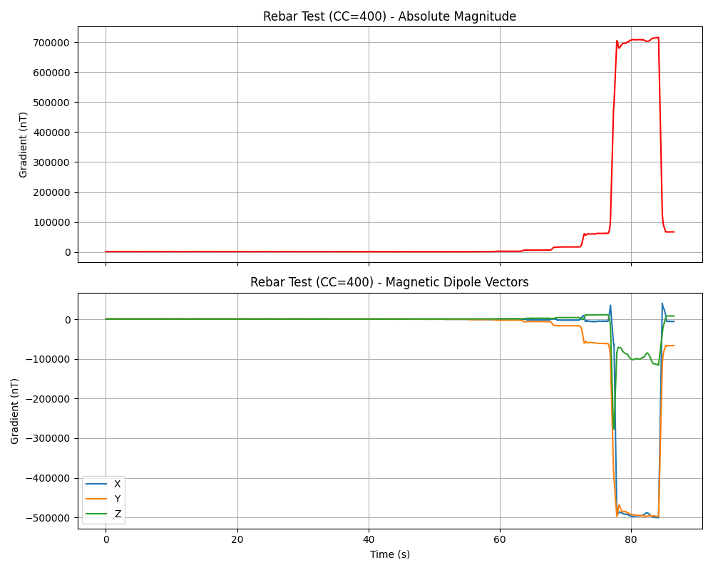

# Analysis: The Magnetic Dipole Effect (Rebar Test)

Your observation of the frequency *dropping* before sharply rising is incredibly insightful. You successfully documented **Destructive Magnetic Interference**.

### What Happened?
Because you ran these tests in **RAW Mode** (Auto-Tare disabled), the wand was outputting the absolute baseline magnitude of the Earth's magnetic field (~1,600 nT in the later logs). 

A long, vertically standing piece of 36" rebar acts like a massive magnetic antenna. The Earth's magnetic field constantly flows through it, turning it into a powerful **Magnetic Dipole** (a giant bar magnet with a distinct North and South pole).

When you slowly brought the bottom of the rebar (let's say it was acting as the South Pole) toward the wand, the magnetic field lines radiating from the rebar were pointing in the **exact opposite direction** of the local Earth field vectors that the wand was currently resting in. 

1. **The Dip (Null Zone):** As the rebar approached, its negative field began *subtracting* from the positive Earth field. This caused the absolute magnitude of the vectors to drop, which drove the UI frequency lower.
2. **The Spike:** As you brought it even closer (within inches), the immense strength of the rebar's local field completely overpowered the background Earth field, crossing the zero-point and violently skyrocketing into the tens of thousands of nT.

This is a classic signature in un-tared gradiometry! If you had tapped **Tare** before bringing the rebar close, the wand would have mathematically deleted the background Earth field, and you would have *only* heard the pure ascending spike of the rebar's field. 

---

I have successfully run the characterization script on the files you gathered. The output is saved to `characterization/v5.1.2/partial_datasheet.md`.

Whenever you are ready, go ahead and capture the next run (Calibration first, AHRS dead last!) and we will mint the final gold-standard datasheet.
