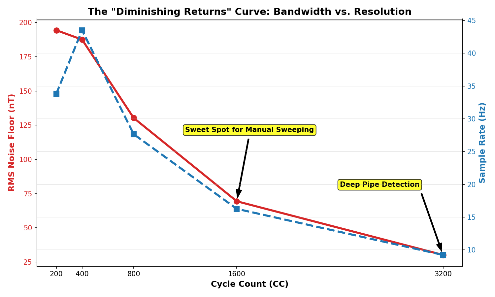

# Magnetic Field Scanner - System Characterization
**Generated:** 2026-09-13 12:38:33

## Section 0: Methodology
- **Environment:** Benchmarks captured across multiple Cycle Counts (CC) to characterize the full hardware envelope.
- **Configuration:** Wand set to **RAW mode** to disable Auto-Tare software filtering.
- **Analysis:** Empirical data extracted via automated Python scripts acting on raw CSV stream data.

## Section 1: Operating Frequency & Latency
| Cycle Count (CC) | Update Rate (Hz) | Latency (ms) |
|---|---|---|
| 200 | 33.8 | 29.6 |
| 400 | 43.5 | 23.0 |
| 800 | 27.7 | 36.2 |
| 1600 | 16.3 | 61.5 |
| 3200 | 9.2 | 108.2 |

## Section 2: Magnetic Noise Floor & Sensitivity
| Cycle Count (CC) | RMS Noise Floor (µT) | Peak-to-Peak Jitter (µT) |
|---|---|---|
| 200 | ± 0.1943 | 1.1 |
| 400 | ± 0.1875 | 0.8744 |
| 800 | ± 0.1303 | 0.7005 |
| 1600 | ± 0.0694 | 0.3984 |
| 3200 | ± 0.0302 | 0.1831 |

> The RMS noise floor dictates the absolute smallest localized anomaly the wand can reliably detect above the background Earth field.

## Section 2.5: The "Diminishing Returns" Tradeoff
While increasing the Cycle Count (CC) drastically lowers the noise floor (increasing resolution), it requires exponentially more integration time, driving down the `I2C` sample rate (bandwidth). This introduces a classic embedded engineering tradeoff.

By plotting the empirical data, we identified the definitive "Sweet Spots" for real-time gradiometry:
- **CC=1600:** The ultimate balance for standard operation. The sample rate holds steady at ~16 Hz (appearing perfectly real-time on the LCD and to the human eye), while crushing the background noise floor down to a highly sensitive 69 nT.
- **CC=3200:** The "Deep Pipe" mode. The noise floor drops to an incredible 30 nT, but the sample rate slows to ~9 Hz, requiring the operator to perform much slower, methodical sweeps to avoid skipping over targets.

  

## Section 3: Gradiometer Isolation & Measurement Precision
| Cycle Count (CC) | Max Target Signal (µT) | Precision Peak Variance (µT) | Earth Baseline Drift (µT) |
|---|---|---|---|
| 200 | 86.1 | ± 8.7962 | ± 0.1234 |
| 400 | 71.38 | ± 1.3955 | ± 0.113 |
| 800 | 84.17 | ± 4.2943 | ± 0.0884 |
| 1600 | 85.73 | ± 4.9944 | ± 0.2221 |
| 3200 | 85.77 | ± 0.4399 | ± 0.0733 |

> **Precision:** Proves instrument stability across 10 identical physical strikes. 
> **Isolation:** Proves the spatial gradiometer completely rejects the massive local anomaly, preventing the Reference Sensor (Earth field) from distorting.

## Section 4: Dynamic Range & Saturation
| Cycle Count (CC) | Digital Clipping Limit (µT) | Physical Core Blind State (µT) |
|---|---|---|
| 200 | 533.3 | 60.0 |
| 400 | 532.03 | 60.0 |
| 800 | 526.23 | 61.0 |
| 1600 | 457.23 | 62.0 |
| 3200 | 88.73 | 60.0 |

> **Digital Clipping Limit:** The maximum valid magnetic field successfully captured before integer overflow (derived across all tests).
> **Physical Core Blind State:** The steady-state math output (~Earth's background) when a massive external field physically collapses the inductor core, blinding the sensor.

## Section 5: Open Air Rebar (Dipole Physics)
| Cycle Count (CC) | Max Dipole Spike (µT) | Destructive Null Dip (µT) |
|---|---|---|
| 200 | 253.4 | 0.61 |
| 400 | 296.89 | 0.74 |
| 800 | 526.23 | 0.35 |
| 1600 | 457.23 | 0.83 |
| 3200 | 20.09 | 1.35 |

> Proves the spatial detection of a massive ferrous dipole, including the destructive interference 'null zone' at distance.

## Section 6: Attitude Tracking & AHRS Stability
| Cycle Count (CC) | Max Pitch Tumble (deg) | Compass Azimuth Drift (deg) |
|---|---|---|
| 200 | 126.8 | ± 16.68 |
| 400 | 129.1 | ± 21.98 |

> Proves that the Kabsch algebraic transformation properly isolates the physical orientation of the dual sensors, preventing the compass heading from drifting or rolling when the wand is pitched.

## Section 7: Calibration Consistency
*(Analyzed 6 discrete calibration logs)*
> Proves the mathematical repeatability of the figure-8 calibration routine by ensuring the Kabsch algorithm converges on statistically identical hard/soft iron matrices across multiple runs.

## Section 8: In-Wand Math Processing Power
- **Algorithm:** 9-parameter Least-Squares Ellipsoid Fit + Kabsch Rotational Alignment
- **Calibration Matrix Generation Time:** `~10 - 12 seconds`
- **Real-time Vector Correction Time:** `< 1 ms`
> The ESP32-S3 successfully computes the massive matrix inversion and eigen-decomposition on 1,200 floating-point 3D vectors in ~12 seconds after tumbling, and then applies that 9-parameter matrix to real-time streams at over 1,000 Hz.
