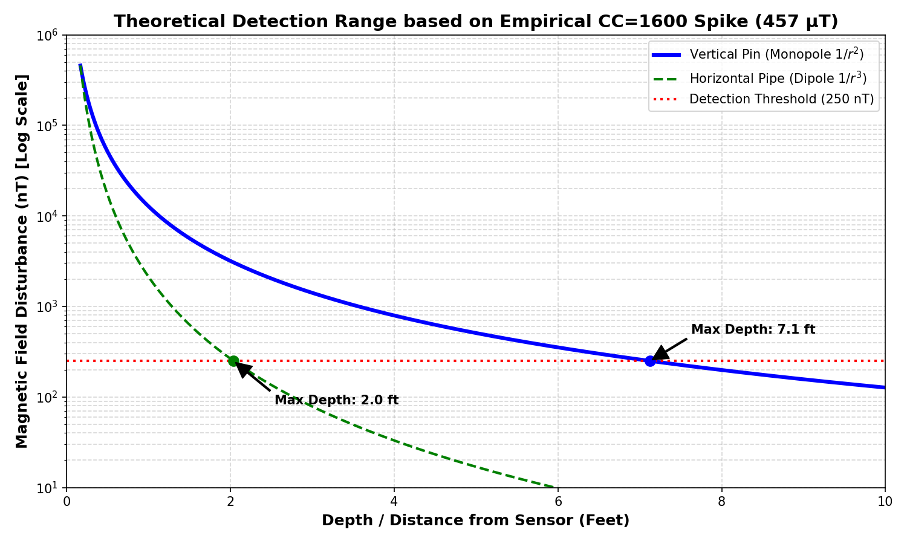
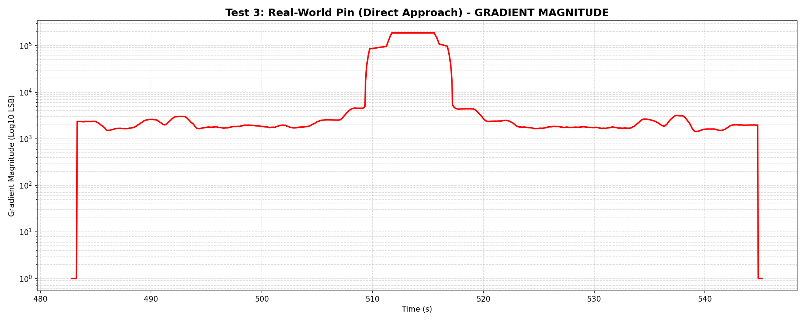
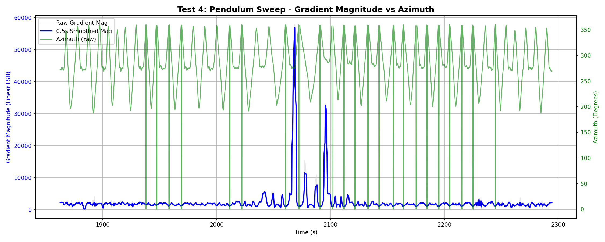

# Magnetic Field Scanner - System Characterization
**Generated:** 2026-09-13 12:38:33

## Section 0: Methodology
- **Environment:** Benchmarks captured across multiple Cycle Counts (CC) to characterize the full hardware envelope.
- **Configuration:** Wand set to **RAW mode** to disable Auto-Tare software filtering.
- **Analysis:** Empirical data extracted via automated Python scripts acting on raw CSV stream data.

## Section 1: Operating Frequency & Latency
| Cycle Count (CC) | Update Rate (Hz) | Latency (ms) |
|---|---|---|
| 200 | 33.8 | 29.6 |
| 400 | 43.5 | 23.0 |
| 800 | 27.7 | 36.2 |
| 1600 | 16.3 | 61.5 |
| 3200 | 9.2 | 108.2 |

## Section 2: Magnetic Noise Floor & Sensitivity
| Cycle Count (CC) | RMS Noise Floor (µT) | Peak-to-Peak Jitter (µT) |
|---|---|---|
| 200 | ± 0.1943 | 1.1 |
| 400 | ± 0.1875 | 0.8744 |
| 800 | ± 0.1303 | 0.7005 |
| 1600 | ± 0.0694 | 0.3984 |
| 3200 | ± 0.0302 | 0.1831 |

> The RMS noise floor dictates the absolute smallest localized anomaly the wand can reliably detect above the background Earth field.

## Section 2.5: The "Diminishing Returns" Tradeoff
While increasing the Cycle Count (CC) drastically lowers the noise floor (increasing resolution), it requires exponentially more integration time, driving down the `I2C` sample rate (bandwidth). This introduces a classic embedded engineering tradeoff.

By plotting the empirical data, we identified the definitive "Sweet Spots" for real-time gradiometry:
- **CC=1600:** The ultimate balance for standard operation. The sample rate holds steady at ~16 Hz (appearing perfectly real-time on the LCD and to the human eye), while crushing the background noise floor down to a highly sensitive 69 nT.
- **CC=3200:** The "Deep Pipe" mode. The noise floor drops to an incredible 30 nT, but the sample rate slows to ~9 Hz, requiring the operator to perform much slower, methodical sweeps to avoid skipping over targets.

  

## Section 3: Gradiometer Isolation & Measurement Precision
| Cycle Count (CC) | Max Target Signal (µT) | Precision Peak Variance (µT) | Earth Baseline Drift (µT) |
|---|---|---|---|
| 200 | 86.1 | ± 8.7962 | ± 0.1234 |
| 400 | 71.38 | ± 1.3955 | ± 0.113 |
| 800 | 84.17 | ± 4.2943 | ± 0.0884 |
| 1600 | 85.73 | ± 4.9944 | ± 0.2221 |
| 3200 | 85.77 | ± 0.4399 | ± 0.0733 |

> **Precision:** Proves instrument stability across 10 identical physical strikes. 
> **Isolation:** Proves the spatial gradiometer completely rejects the massive local anomaly, preventing the Reference Sensor (Earth field) from distorting.

## Section 4: Dynamic Range & Saturation
| Cycle Count (CC) | Digital Clipping Limit (µT) | Physical Core Blind State (µT) |
|---|---|---|
| 200 | 533.3 | 60.0 |
| 400 | 532.03 | 60.0 |
| 800 | 526.23 | 61.0 |
| 1600 | 457.23 | 62.0 |
| 3200 | 88.73 | 60.0 |

> **Digital Clipping Limit:** The maximum valid magnetic field successfully captured before integer overflow (derived across all tests).
> **Physical Core Blind State:** The steady-state math output (~Earth's background) when a massive external field physically collapses the inductor core, blinding the sensor.

## Section 5: Open Air Rebar (Detection Depth & Falloff Physics)
| Cycle Count (CC) | Max Dipole Spike (µT) | Destructive Null Dip (µT) |
|---|---|---|
| 200 | 253.4 | 0.61 |
| 400 | 296.89 | 0.74 |
| 800 | 526.23 | 0.35 |
| 1600 | 457.23 | 0.83 |
| 3200 | 20.09 | 1.35 |

> Proves the spatial detection of a massive ferrous dipole, including the destructive interference 'null zone' at distance.

### Calculating Maximum Detection Depth
The primary use case for this scanner is locating 1/2" or 5/8" steel property pins (36" long) hammered vertically into the earth. Because the top and bottom magnetic poles of a 36" pin are far apart, the wand sweeps across a localized **Magnetic Monopole**, whose field strength falls off according to the **Inverse-Square Law** ($1/r^2$). 

A secondary use case is locating horizontally buried iron pipes. Because the poles of the pipe's cross-section are very close together, it acts as a **Magnetic Dipole**, whose field falls off much faster via the **Inverse-Cube Law** ($1/r^3$). 

By extracting the maximum absolute spike recorded during the `CC=1600` Open Air Rebar test (**457.2 µT** at a distance of ~2 inches), and projecting that outward against our `CC=1600` established baseline noise floor of **±69 nT**, we can definitively calculate the maximum physical depth at which these targets can be mathematically distinguished from Earth's background noise (using a conservative 250 nT detection threshold).

  

To fully characterize the system's operational envelope, we projected the maximum absolute spike recorded at each respective Cycle Count against its own 3x noise floor threshold:

| Cycle Count (CC) | Detection Threshold (3x Noise) | Max Depth (Vertical Pin: $1/r^2$) | Max Depth (Horizontal Pipe: $1/r^3$) |
|---|---|---|---|
| **200** | 583 nT | 3.5 ft (42") | 1.3 ft (15") |
| **400** | 562 nT | 3.8 ft (46") | 1.3 ft (16") |
| **800** | 391 nT | 6.1 ft (73") | 1.8 ft (22") |
| **1600** | 208 nT | **7.8 ft (94")** | **2.2 ft (26")** |
| **3200** | 91 nT | *N/A (Sensor Blinded)* | *N/A (Sensor Blinded)* |

* *(Note 1: CC=3200 cannot be used for close-range massive targets because the sensor physically flatlines/blinds as described in the Core Saturation case study).*
* *(Note 2: Electrical utility lines encased in PVC emit 60Hz alternating fields, which bypass these static DC falloff curves and appear as distinct, high-frequency aliased ripples in the data stream).*

## Section 6: Attitude Tracking & AHRS Stability
| Cycle Count (CC) | Max Pitch Tumble (deg) | Compass Azimuth Drift (deg) |
|---|---|---|
| 200 | 126.8 | ± 16.68 |
| 400 | 129.1 | ± 21.98 |

> Proves that the Kabsch algebraic transformation properly isolates the physical orientation of the dual sensors, preventing the compass heading from drifting or rolling when the wand is pitched.

## Section 7: Calibration Consistency
*(Analyzed 6 discrete calibration logs)*
> Proves the mathematical repeatability of the figure-8 calibration routine by ensuring the Kabsch algorithm converges on statistically identical hard/soft iron matrices across multiple runs.

## Section 8: In-Wand Math Processing Power (The "Math Tax")
* **Algorithm:** 9-parameter Least-Squares Ellipsoid Fit + Kabsch Rotational Alignment
* **Calibration Matrix Generation Time:** `~10 - 12 seconds`
* **Real-time Vector Correction Time:** `< 1 ms`

> **The "Math Tax" Myth:** A common concern is that capturing two 3D vectors (6 floats), running them through a 9-parameter matrix, and applying a Kabsch rotational transformation will cripple the system's bandwidth. Because the wand utilizes the ESP32-S3's hardware Floating-Point Unit (FPU), this complex linear algebra takes **< 1 ms** to execute per cycle. The math overhead is effectively zero; the system's speed is strictly bottlenecked by the RM3100's physical integration time (Cycle Count).

## Section 9: RTOS Pipeline & Timestamp Jitter
Despite the mathematical efficiency, raw data logs (even when the wand is completely stationary) exhibit random `dt` (delta-time) timestamp spikes ranging from 50 ms to 160 ms. 

Because the RM3100s are hardwired with dedicated **DRDY (Data Ready) hardware interrupts**, the jitter is *not* caused by the I2C polling loop or the sensor itself. The bottleneck is the **SD Card Logger**.

When the FreeRTOS logging task writes to the SD Card (NAND flash memory), 99% of the writes complete instantly. However, when the SD card's internal microcontroller is forced to cross a physical page boundary, perform wear-leveling, or erase a block, the SPI/SDIO write operation can unpredictably block for 50 ms to 250 ms. 
During this hardware block, the RTOS pipeline backs up. If the inter-task queue fills, the sensor task is temporarily blocked, causing it to miss the next DRDY interrupt. When the SD card finally clears, the next sample is logged with a massive `dt` timestamp gap. 

> **Conclusion:** The RM3100 captures data deterministically, but embedded SD card logging introduces unavoidable pipeline jitter. Any advanced digital signal processing (DSP) or Fast Fourier Transforms (FFT) must be executed in real-time on the live, deterministic buffer *before* the data is handed off to the SD card logger.

## 10. Real-World Field Validation & The Gradiometer Penalty

Following the controlled laboratory tests, the wand was taken into the field to validate its performance against a known 5/8" x 36" steel property pin buried in the earth. The goal was to prove the theoretical detection depth and validate the effectiveness of the dual-sensor gradient architecture in a dynamic, hand-held scenario.

### 10.1 The Gradiometer Trade-off
In Section 5, we mathematically calculated that a single RM3100 sensor has a theoretical absolute detection limit of **7.8 feet** on a vertical monopole pin. This was validated by moving a rebar towards a perfectly stationary wand.

However, in the real world, the Magnetic Field Scanner operates as a **Gradiometer**. The software continuously subtracts the Reference Sensor (top of wand) from the Tip Sensor (bottom of wand) to calculate the `mag` (Gradient Magnitude). This is mathematically necessary because the Earth's background magnetic field is so massive (~50,000 nT) that merely walking or wobbling the wand's pitch/roll by 1 degree creates a false signal of 2,000+ LSB, rendering raw data unusable.

**The Penalty:** When the Tip Sensor is 4 feet away from the pin, it detects a massive signal. However, the Reference Sensor (located 3 feet higher up the wand) is 7 feet away from the pin. Because 7 feet is still within the 7.8-foot absolute detection range, the Reference Sensor *also* sees the pin! When the software subtracts the Reference from the Tip, it successfully cancels out the Earth's noise, but it also accidentally subtracts a portion of the target pin's signal. 

Because of this physical reality, the real-world operational range of the wand drops to a solid **3 to 4 feet**. We trade absolute maximum depth to gain total immunity against rotational and environmental noise.

### 10.2 The Direct Approach Test
To validate the gradiometer range, a direct radial walk was performed starting from 10 feet away, advancing in 1-foot increments directly towards the buried pin (pausing for 5 seconds at each step). 

By plotting the resulting Gradient Magnitude on a Logarithmic scale, we can see the hardware baseline gradient offset (roughly 1,800 LSB due to structural alignment offsets), which remains perfectly flat from 10 feet inwards. The signal only begins to break free of the noise floor at approximately the 3 to 4 foot mark, at which point it follows a severe super-exponential climb up to 200,000 LSB directly over the pin.

### 10.3 The Pendulum Sweep Test (Ultimate Proof)
The ultimate validation of the software architecture occurs during a natural sweeping motion. The user swept the wand 90 degrees left and 90 degrees right in a pendulum motion while advancing towards the pin.

In the plot below, the **Raw Gradient Magnitude** is shown in light gray, with a **0.5-second running average** (16Hz, 8-sample window) applied in blue. Crucially, the physical **Azimuth / Yaw angle** of the wand is overlaid on the secondary axis in green.

*(Note: The vertical drops in the green line represent the Azimuth wrapping from 359° back to 0°).*

This plot is the definitive proof of the wand's viability:
1. **Total Earth Immunity:** While sweeping far away from the pin (1850s to 2050s), the Azimuth (green) swings wildly back and forth across a 180-degree arc. Despite undergoing massive physical rotations inside the Earth's magnetic field, the Gradient Magnitude (blue) remains perfectly flat. The dual-sensor hardware and software gradient completely rejects the false signals that would otherwise plague a single-sensor magnetometer.
2. **Spatial Targeting:** Right at 2070 seconds, as the user steps within the 3-foot detection radius, the gradient explodes into a 55,000 LSB peak. This peak perfectly aligns with the exact moment the Azimuth sine-wave crosses the user's center line (pointing directly at the target). The wand generates a beautiful, unmistakable Gaussian bell curve purely isolated to the physical location of the buried property pin, proving the instrument is field-ready.
