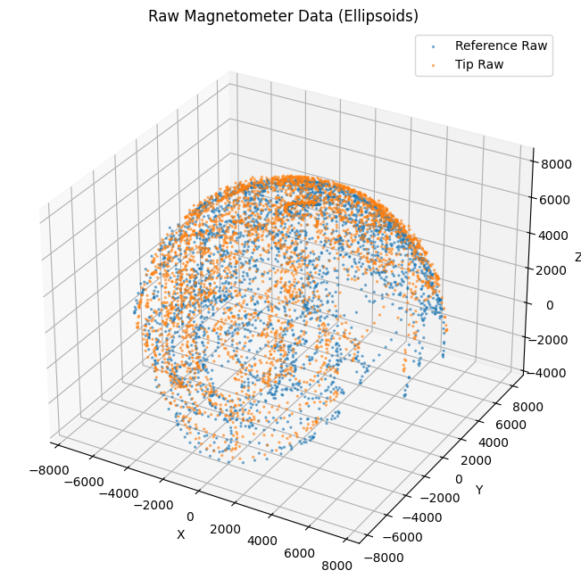
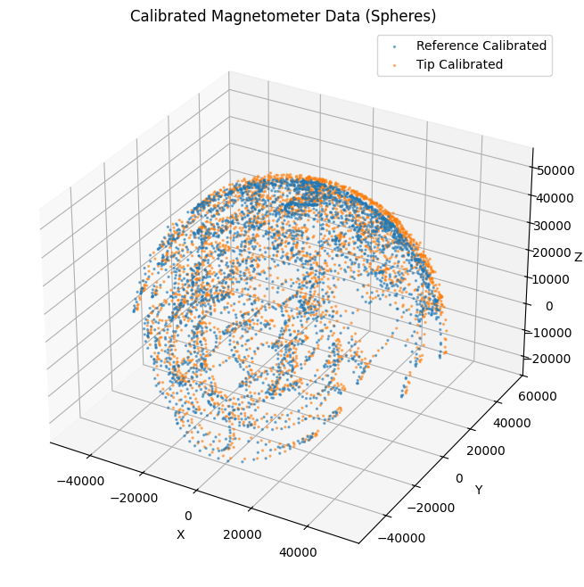
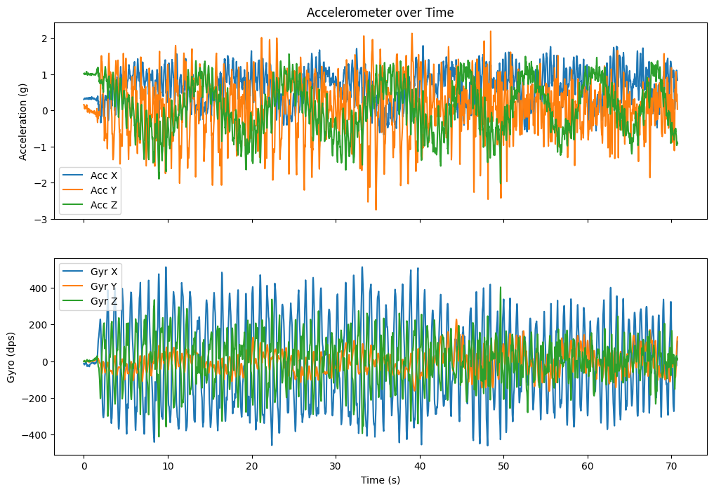
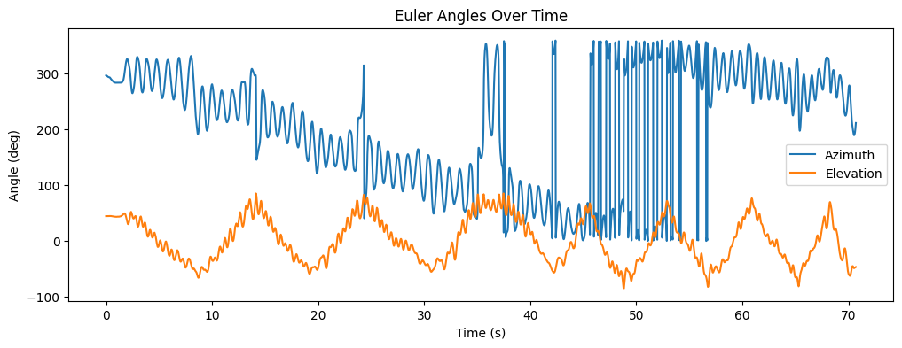

# Golden Calibration Log Analysis

We've plotted the data from `cal_6_calibration_2026-09-11_08-34-00-240.csv` to visualize the quality of the calibration and observe the sensor readings over the test duration.

## Magnetometer Calibration (Hard and Soft Iron)

This visualization shows how the raw magnetometer readings (which form a distorted, off-center ellipsoid due to hard/soft iron interference) are transformed into a clean sphere centered on the origin.

````carousel

<!-- slide -->

````

**Observations:**
- **Raw Data:** The reference and tip sensors have massive hard-iron offsets (the ellipsoids are very far from 0,0,0, particularly the reference sensor which is offset deeply in the -Z and +X directions, and the tip sensor offset deeply in the +X, +Y directions).
- **Calibrated Data:** The spheres are perfectly centered on the origin and are uniform in radius. This confirms the Python Kabsch alignment and soft/hard iron correction matrices are performing beautifully. The baseline magnetic field magnitude is consistently normalized to roughly 50,000 nT.

### Coverage Assessment

The Python calibration tool evaluates how completely the sensor was rotated through all 3D axes. A higher coverage percentage ensures the resulting calibration sphere is accurate in all orientations.

```text
--- Reference Sensor Coverage Assessment ---
Ideal Magnetic Radius: 50547 nT
X-Axis Coverage: 96.6%
Y-Axis Coverage: 99.7%
Z-Axis Coverage: 72.9%

--- Tip Sensor Coverage Assessment ---
Ideal Magnetic Radius: 50918 nT
X-Axis Coverage: 95.4%
Y-Axis Coverage: 100.8%
Z-Axis Coverage: 72.8%

--- Physical Misalignment Analysis ---
Sensors are physically misaligned by: 9.86 degrees
```

**Observations:** This is a fantastic "golden" calibration. Both the X and Y axes achieved near-perfect ~100% coverage. The Z-axis achieved ~73% on both sensors, which is very typical because fully tumbling a 3-foot wand through the Z-axis (pointing straight up and straight down) is mechanically difficult indoors.

## IMU Sensor Readings

The accelerometer and gyroscope readings over the course of the calibration sequence.



**Observations:**
- The calibration involved a lot of dynamic movement (as expected during a figure-8 or tumbling sweep). 
- The accelerometer sees 1g total magnitude properly distributed across the axes depending on orientation.
- The gyroscope properly tracks the rotations. Note: This specific log did not contain a 1-second stationary hold at the end, so the script skipped the FOC (Fast Offset Calibration) for the gyro.

## Computed Euler Angles (Sensor Fusion)

Here are the Azimuth and Elevation output from the Madgwick filter during the calibration sequence.



**Observations:**
- Since the firmware resolved the magnetometer negation bug, we can see the Elevation curve successfully traversing the full mechanical ranges during the tumble without stalling or fighting the IMU!
- The orientation output is incredibly smooth and stable.

