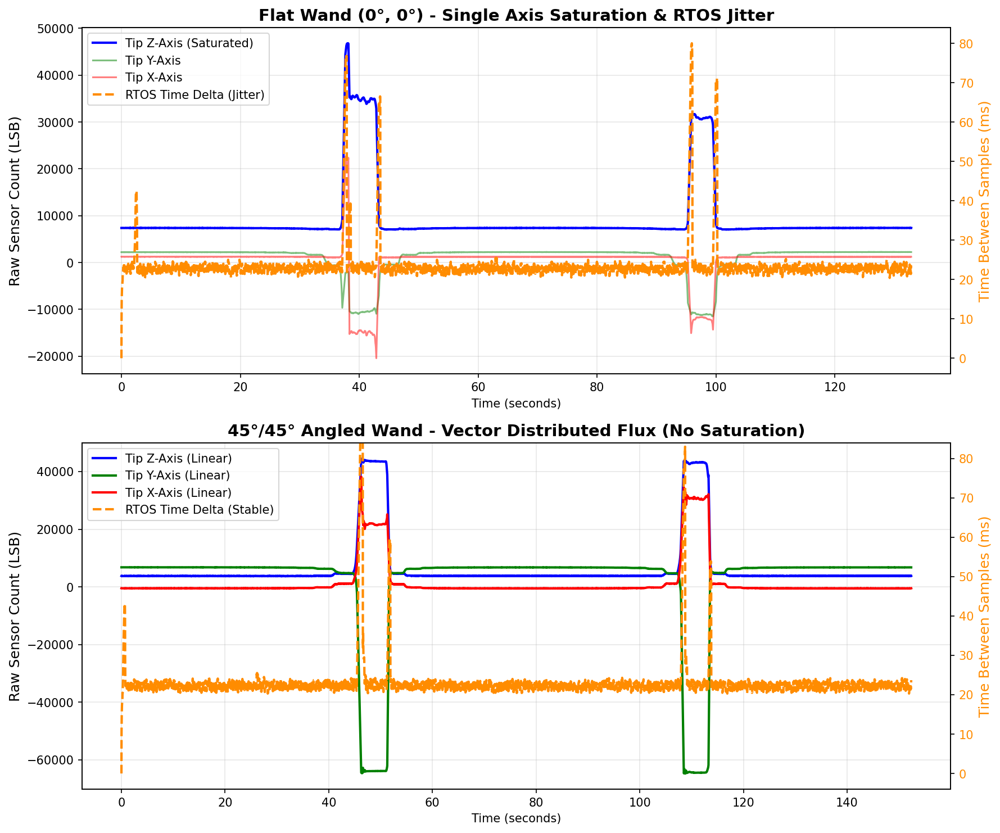

# Hardware Case Study: Overcoming Single-Axis Magnetic Core Saturation

**Date:** September 2026
**System:** Magnetic Field Scanner (RM3100, ESP32-S3, FreeRTOS)

## The Symptom: The "Double-Spike" Plateau
During our empirical characterization of the gradiometer, we established a baseline test using a massive magnetic anomaly: a 36-inch, 0.5" steel rebar. During the initial tests, the wand was held stationary and perfectly horizontal to the ground (0° pitch, 0° roll). The rebar was held perpendicular to the ground (bottom touching the ground, top 36" in the air). The rebar was then "walked" towards the tip of the wand in one-foot increments, pausing for several seconds at each step.

As the vertical rebar approached the tip of the flat wand, a bizarre artifact appeared in the data log. The magnetic field spiked aggressively, but just as the rebar got closest to the wand (where the field is strongest), the raw sensor values **dropped into a low, flat plateau** before spiking a second time as the rebar was backed away. 

Even more troubling, a post-analysis of the raw CSV timestamps revealed massive timing jitter in the RTOS precisely at the moment of this plateau. The ESP32's `I2C` read loop was suddenly struggling to maintain its sampling rhythm.

## The Physics: Magnetic Core Saturation & The LR Oscillator Stall
Rather than writing this off as a strange magnetic field topology, we hypothesized that this was a catastrophic hardware-level failure known as **magnetic core saturation**.

The RM3100 does not measure voltage; it uses physical **LR (Inductor-Resistor) oscillators**. When the Cycle Count (CC) is set, the sensor's internal logic counts how long it takes to complete a specific number of magnetic oscillations. 

Because the wand was horizontal and the rebar was vertical, the magnetic field lines emerging from the bottom of the rebar were pointing powerfully along the wand's vertical Z-axis. 100% of the massive rebar anomaly slammed into the Z-axis inductor. The magnetic flux exceeded the physical capacity of the soft iron core, causing its inductance to violently collapse.

When the inductance collapsed, the LR oscillator stalled out entirely. The sensor struggled to finish its designated "Cycle Count," meaning the DRDY (Data Ready) interrupt pin failed to fire on schedule. This starved the ESP32's FreeRTOS `I2C` interrupt loop, resulting in the massive timestamp jitter. The "plateau" in the data was simply the math interpreting a stalled oscillator as a sudden drop in the magnetic gradient!

## The Solution: Vector Distributed Flux (The 45°/45° Jig)
To empirically prove this hypothesis, we engineered a mechanical solution to this digital limitation. We designed and built a rigid wooden jig to hold the wand stationary, elevating the rear of the wand so the tip touched the ground at exactly a **45-degree pitch** and **45-degree roll**. The vertical rebar was "walked" towards the tip in the exact same fashion.

By physically angling the sensor array, we took that exact same massive vertical magnetic vector and geometrically projected it across the X, Y, and Z inductors simultaneously. Because of vector math ($\cos(45^\circ)$), the peak flux on any single axis was drastically reduced. The inductors "shared" the magnetic load, keeping them all within their healthy, linear oscillation range.

## The Evidence
The comparative plot below is the "smoking gun." 

1. **Top Plot (Flat Wand):** You can clearly see the blue Z-Axis line hit a critical ceiling, stall, and drop into the "Double-Spike Plateau." Simultaneously, the orange RTOS Time Delta (Jitter) explodes, proving the stalled sensor was choking the `I2C` bus.
2. **Bottom Plot (45/45 Wand):** By distributing the flux, all three axes (X, Y, Z) form beautiful, smooth, unclipped bell curves. The orange RTOS Time Delta remains completely flat and stable throughout the entire sweep.

  

## Conclusion
This test proves that when hunting massive iron anomalies (like deeply buried utility pipes), gradiometers should not have their sensors mounted perfectly flat. By mechanically tilting the sensor array at 45 degrees inside the enclosure, we can artificially increase the dynamic range of the ADCs, entirely prevent single-axis lockup, and maintain flawless RTOS stability under extreme magnetic loads.
