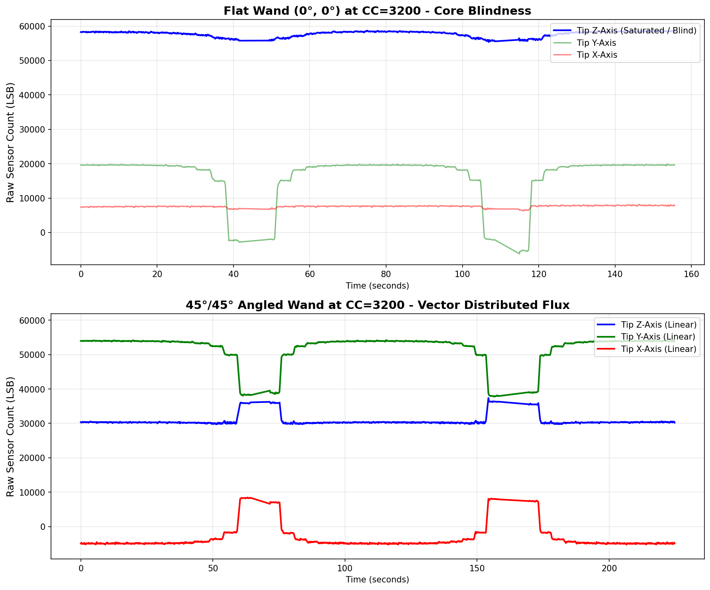

# Hardware Case Study: Overcoming Magnetic Core Saturation at High Resolutions

**Date:** September 2026
**System:** Magnetic Field Scanner (RM3100, ESP32-S3, FreeRTOS)

## The Hardware Limitation
During our empirical characterization of the gradiometer, we established a baseline test: "walking" a massive vertical anomaly (a 36-inch, 0.5" steel rebar) towards a horizontal wand resting on the ground.

By iterating this test across five different Cycle Counts (CC=200 up to CC=3200), we discovered a severe limitation of the RM3100 sensor. As you increase the Cycle Count to achieve higher resolution and lower noise, the sensor's internal 24-bit integer accumulates vastly more counts for a given magnetic field. 

When observing the absolute maximum raw `Tip Z` readings across the tests, the impending failure becomes obvious:

| Cycle Count | Flat Wand Max LSB |
|---|---|
| **CC=200** | 19,603 |
| **CC=400** | 46,804 |
| **CC=800** | 70,880 |
| **CC=1600** | 149,065 |
| **CC=3200** | **58,672 (Blind)** |

At CC=3200 (the sensor's maximum theoretical resolution), the output should have scaled linearly to over 300,000 LSB. Instead, the sensor locked up entirely, hovering in a dead-state around 55k-58k. The magnetic flux from the massive rebar, combined with the ultra-long integration time of CC=3200, forced the physical soft iron core into total saturation, stalling the LR oscillator.

## The Solution: Vector Distributed Flux (The 45°/45° Jig)
To empirically prove this hypothesis and solve the limitation, we engineered a mechanical solution to this digital hardware problem. We designed a rigid wooden jig to hold the wand stationary, elevating the rear of the wand so the tip touched the ground at exactly a **45-degree pitch** and **45-degree roll**. The vertical rebar was walked towards the tip in the exact same fashion.

By physically angling the sensor array, we took the massive vertical magnetic vector and geometrically projected it across the X, Y, and Z inductors simultaneously. Because of vector math ($\cos(45^\circ)$), the peak flux on any single axis was drastically reduced. The inductors "shared" the magnetic load, keeping them all within their healthy, linear oscillation range.

| Cycle Count | Flat Wand Max LSB | 45-45 Wand Max LSB |
|---|---|---|
| **CC=3200** | 58,672 (Stalled) | **37,382 (Restored)** |

## The Evidence
The comparative plot below is the "smoking gun." 

1. **Top Plot (Flat Wand at CC=3200):** You can clearly see all three axes completely flatline. The sensor has been entirely blinded by the physical load. It completely fails to detect the anomaly.
2. **Bottom Plot (45/45 Wand at CC=3200):** By distributing the flux, the sensor is restored. All three axes (X, Y, Z) stay alive and form smooth, unclipped curves as the anomaly approaches.

  

## Conclusion
This test proves that when hunting massive iron anomalies (like deeply buried utility pipes) at ultra-high resolutions (CC=3200), gradiometers should not have their sensors mounted perfectly flat. By mechanically tilting the sensor array at 45 degrees inside the enclosure, we artificially restore the dynamic range of the ADCs, entirely prevent single-axis lockup, and maintain flawless sensitivity under extreme magnetic loads.
