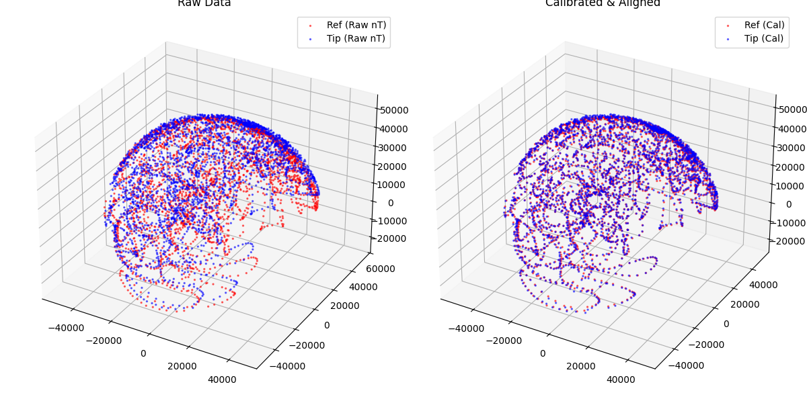
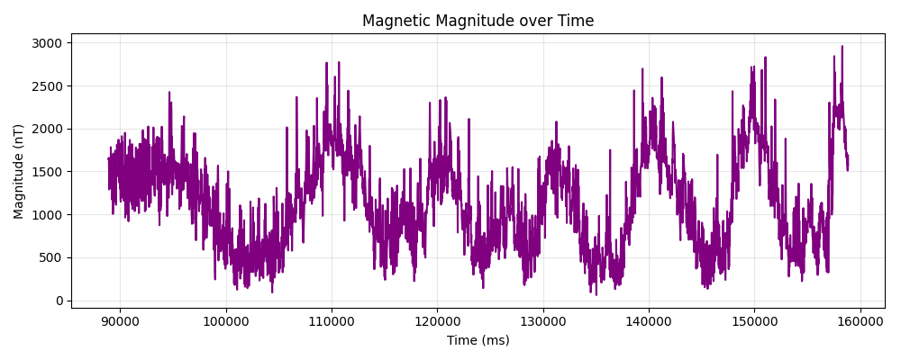
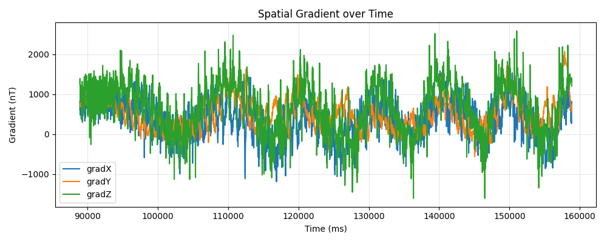
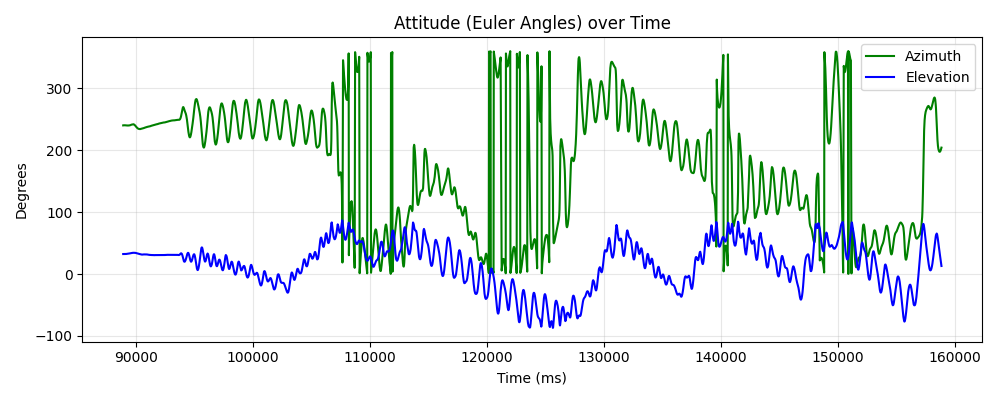

# Magnetic Scan Analysis Report
**Generated:** 2026-09-14 11:49:02
**Source File:** `cal_1_calibration_2026-09-11_08-25-06-240.csv`

## Metrics
| Metric | Value |
|--------|-------|
| Data Points | 3000 |
| Duration (s) | 69.97 |
| File Type | Calibration |
| Ref Fit Variance | 114608.4313 |
| Tip Fit Variance | 121338.2855 |
| Kabsch Rotation (deg) | 9.92 |
| Ref Coverage | X=95.1%, Y=99.7%, Z=73.4% |
| Tip Coverage | X=90.9%, Y=100.6%, Z=73.4% |
| Magnitude Variance (Noise) | 297903.8493 |
| Magnitude P2P (nT) | 2900.99 |
| Max Gradient Magnitude | 2959.9537 |

## Visualizations

