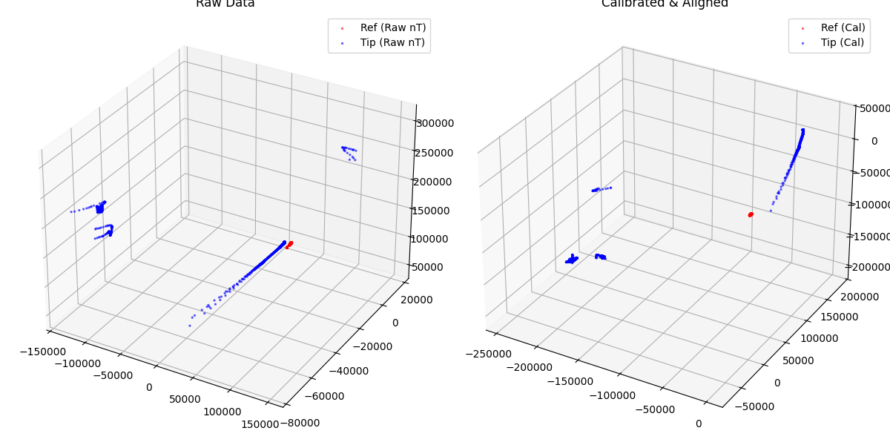
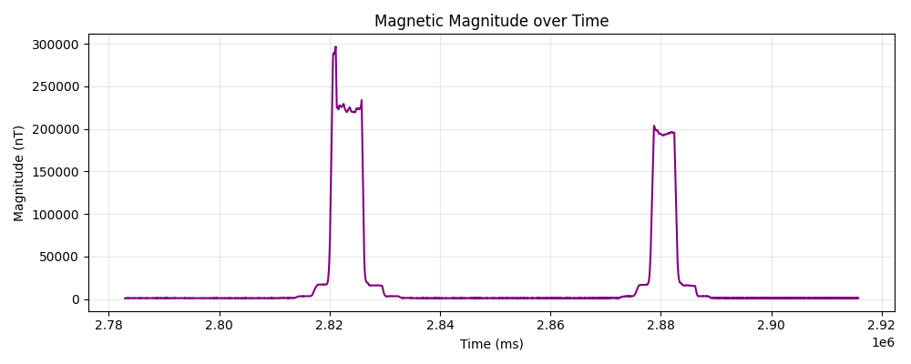
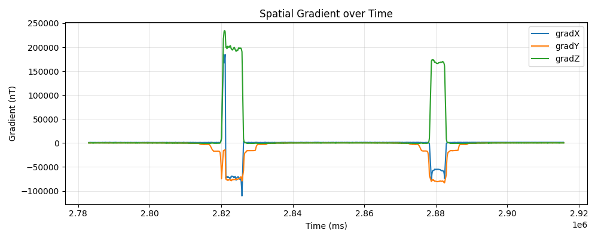
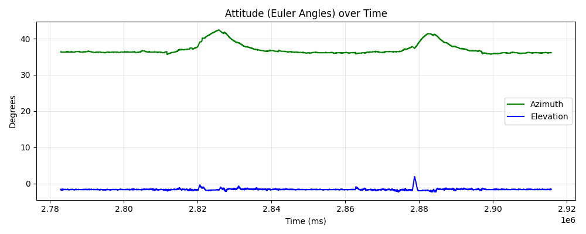

# Magnetic Scan Analysis Report
**Generated:** 2026-09-14 11:21:58
**Source File:** `log_rebar_400_log_2026-09-11_09-10-00-240.csv`

## Metrics
| Metric | Value |
|--------|-------|
| Data Points | 5703 |
| Duration (s) | 132.84 |
| File Type | Log |
| Ref Fit Variance | 6779.6805 |
| Tip Fit Variance | 596692096.8605 |
| Kabsch Rotation (deg) | 82.02 |
| Ref Coverage | X=49.6%, Y=138.8%, Z=64.3% |
| Tip Coverage | X=161.6%, Y=51.6%, Z=149.0% |
| Magnitude Variance (Noise) | 2872776570.4328 |
| Magnitude P2P (nT) | 296155.88 |
| Max Gradient Magnitude | 296892.0585 |

## Visualizations

