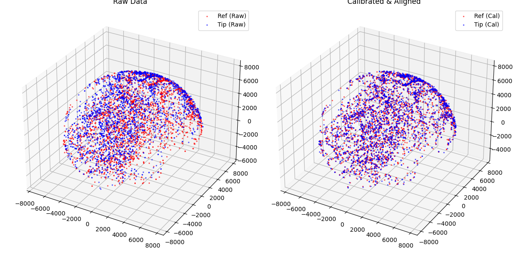
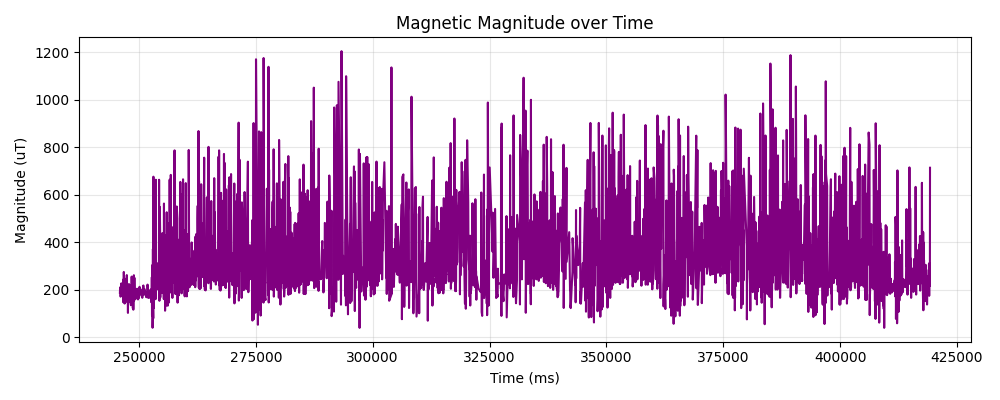
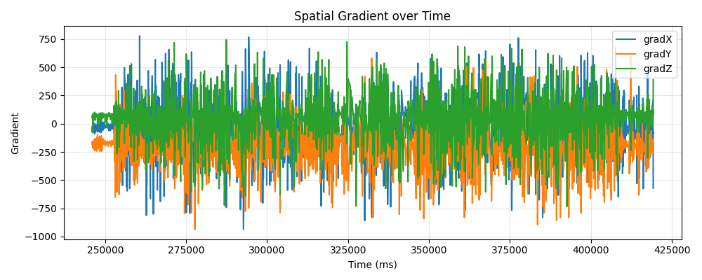
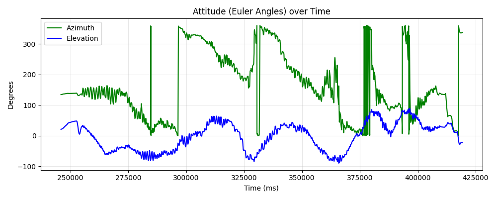

# Magnetic Scan Analysis Report
**Generated:** 2026-08-29 17:58:57
**Source File:** `v3.6.25 calibration_2026-08-29_17-11-49-240.csv`

## Metrics
| Metric | Value |
|--------|-------|
| Data Points | 3000 |
| Duration (s) | 173.3 |
| File Type | Calibration |
| Ref Fit Variance | 725.6841 |
| Tip Fit Variance | 789.1301 |
| Kabsch Rotation (deg) | 9.84 |
| Ref Coverage | X=96.9%, Y=97.5%, Z=81.2% |
| Tip Coverage | X=95.1%, Y=98.1%, Z=84.5% |
| Magnitude Variance (Noise) | 32128.9191 |
| Magnitude P2P (uT) | 1166.2 |
| Max Gradient Magnitude | 1205.1382 |

## Visualizations

