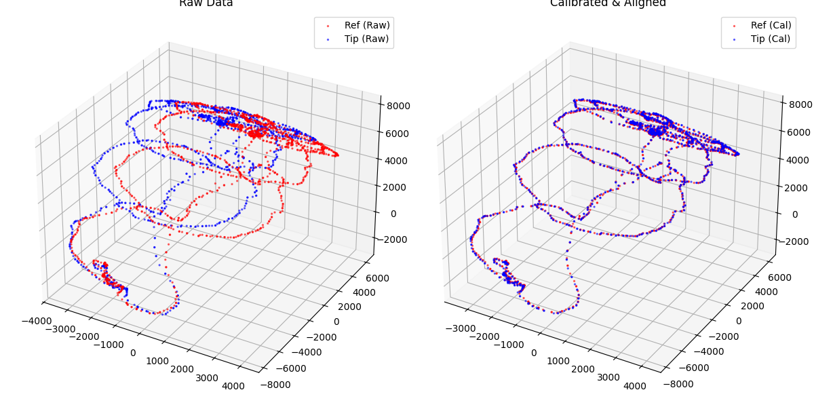
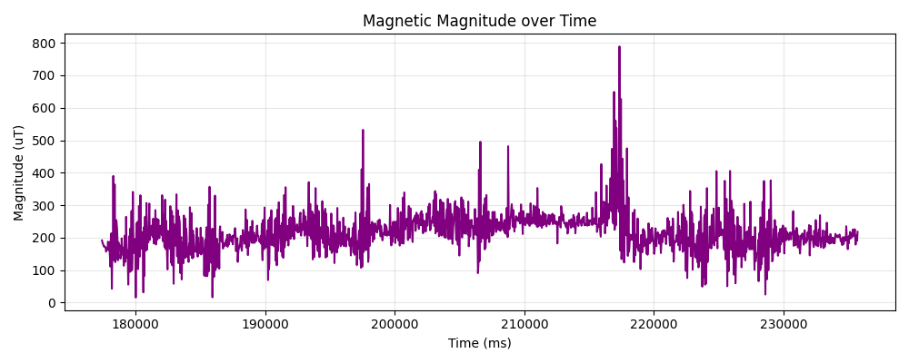
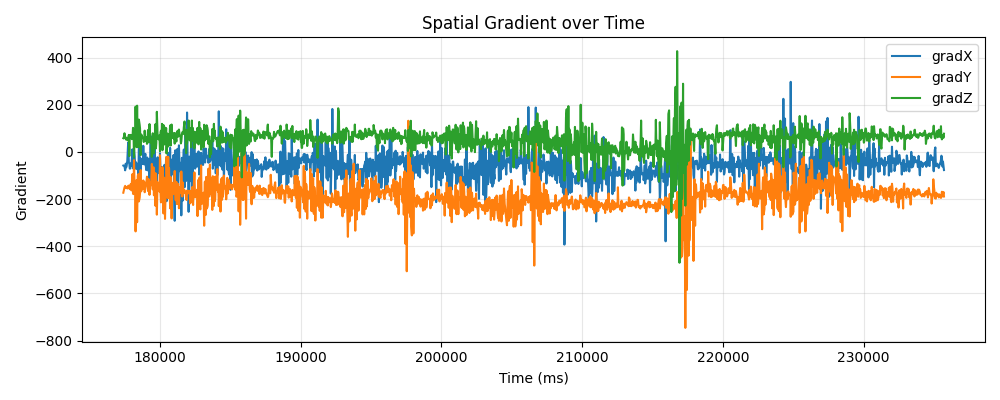
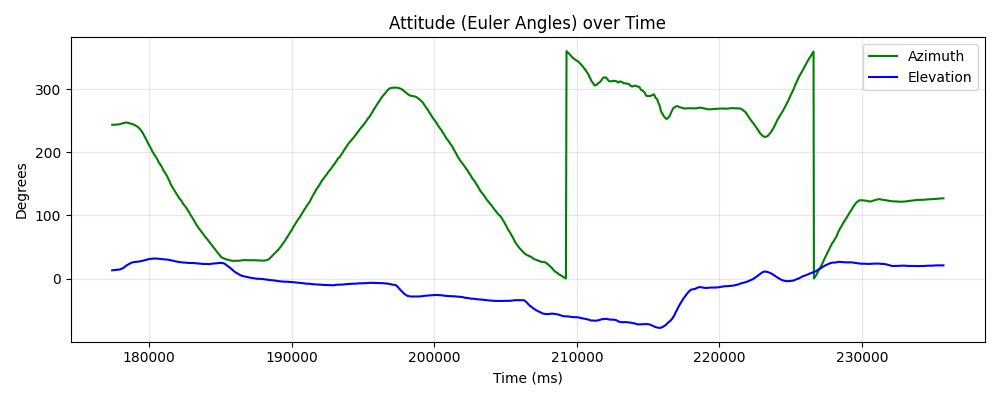

# Magnetic Scan Analysis Report
**Generated:** 2026-08-29 17:58:24
**Source File:** `v3.6.25 log_2026-08-29_17-10-40-240.csv`

## Metrics
| Metric | Value |
|--------|-------|
| Data Points | 1591 |
| Duration (s) | 58.31 |
| File Type | Log |
| Ref Fit Variance | 109.0774 |
| Tip Fit Variance | 186.4616 |
| Kabsch Rotation (deg) | 9.89 |
| Ref Coverage | X=49.0%, Y=88.2%, Z=66.6% |
| Tip Coverage | X=43.0%, Y=88.2%, Z=67.1% |
| Magnitude Variance (Noise) | 3733.7006 |
| Magnitude P2P (uT) | 773.4 |
| Max Gradient Magnitude | 788.9385 |

## Visualizations

